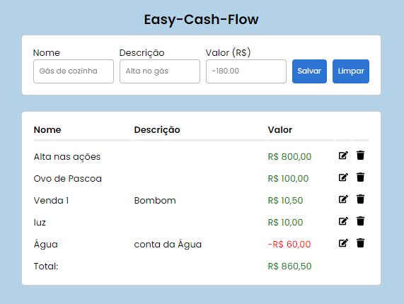

# Easy-Cash-Flow

## Descrição
### Fluxo de caixa básico desenvolvido em React.js
## Requerimentos
### - IDE Visual Studio Code
### - Node.js
### - MySQL Workbench
## Uso
1. Abrir o arquivo cash.sql com MySQL Workbench
1. Selecionar todas as linhas com ctrl+a
1. Executar
1. Abrir o Visual Studio Code
1. Abrir a pasta do projeto
1. Usar npm i
1. Criar dois terminais
1. Usar cd api no primeiro
1. Usar npm start no primeiro
1. Usar cd frontend no segundo
1. Usar npm start no segundo